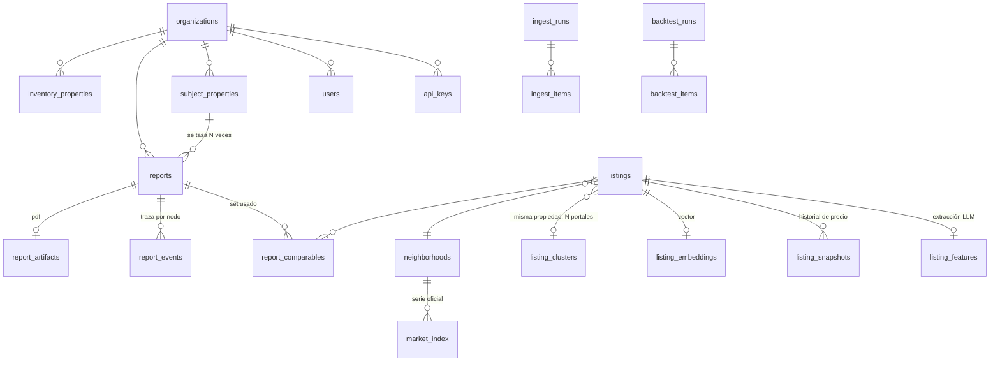

# 03 — Modelo de datos

**Motor:** PostgreSQL 16 · extensiones `pgvector`, `pg_trgm`, `unaccent`, `pgcrypto`
**Schemas:** `core` (operación), `corpus` (avisos), `eval` (backtest)
**Migraciones:** Alembic, versionadas, siempre aditivas.

---

## 1. Convenciones

Se heredan las que ya funcionaron en el panel de la inmobiliaria, con dos correcciones
conscientes:

| Convención | Detalle |
|---|---|
| Tablas en inglés, snake_case, plural | `reports`, `listings` |
| PK `id uuid default gen_random_uuid()` | siempre |
| `org_id uuid NOT NULL` en toda tabla raíz | multi-tenant desde el día 1 (ADR-007) |
| `created_at timestamptz not null default now()` | UTC en base, siempre |
| Estados en MAYÚSCULA | `QUEUED`, `SUCCEEDED` |
| CHECK con lista cerrada para todo enum | nada de texto libre en columnas de estado |
| Índices `idx_<tabla>_<qué>` | prefijo, no sufijo |
| **Corrección 1:** casing de `source` uniforme desde el día 1 | `PORTAL_A`, `PORTAL_B`, `CRM`, `BADATA`, `MELI`, `MANUAL`. En el panel quedó mixto por herencia; acá se fija por CHECK |
| **Corrección 2:** todo dinero lleva su moneda al lado | nunca un `price` suelto |

---

## 2. Diagrama



---

## 3. Schema `core` — operación

### 3.1 `organizations` — tenants

```sql
create table core.organizations (
  id              uuid primary key default gen_random_uuid(),
  name            text not null,
  slug            text not null unique,
  timezone        text not null default 'America/Argentina/Buenos_Aires',
  active          boolean not null default true,
  -- marca para el PDF
  logo_path       text,
  brand_color     text,
  report_footer   text,
  -- límites por tenant
  monthly_report_quota  integer not null default 200 check (monthly_report_quota > 0),
  fetch_budget_monthly  integer not null default 2000 check (fetch_budget_monthly >= 0),
  -- integración el CRM para tenants sin panel (modo pull)
  crm_api_key_enc     bytea,
  crm_sync_mode       text not null default 'push'
                        check (crm_sync_mode in ('push','pull','none')),
  created_at      timestamptz not null default now(),
  updated_at      timestamptz not null default now()
);
```

**No obvio:**

- `crm_sync_mode='push'` es el default y el modo de la inmobiliaria: **el Tasador no llama
  a el CRM**, el panel empuja. Elimina el riesgo de cuota (ver [02 §2.3](02-fuentes-de-datos.md)).
- `crm_api_key_enc` es `bytea`, cifrado con `pgcrypto` usando una clave del entorno.
  Nunca en texto plano, nunca en logs.
- `fetch_budget_monthly` es el tope duro de requests a portales por tenant. Al
  agotarse, el sistema usa caché y lo dice, en vez de gastar de más en silencio.

### 3.2 `api_keys`

```sql
create table core.api_keys (
  id           uuid primary key default gen_random_uuid(),
  org_id       uuid not null references core.organizations(id) on delete cascade,
  name         text not null,
  prefix       text not null,               -- 'tsk_live_a1b2' visible, para identificar
  key_hash     text not null,               -- argon2id del secreto completo
  scopes       text[] not null default '{reports:write,reports:read}',
  last_used_at timestamptz,
  revoked_at   timestamptz,
  created_at   timestamptz not null default now(),
  constraint api_keys_prefix_unique unique (prefix)
);
create index idx_api_keys_org on core.api_keys (org_id) where revoked_at is null;
```

Solo se guarda el hash. El secreto se muestra una vez al crearlo. `prefix` permite
mostrar "tsk_live_a1b2…" en la UI e identificar cuál se usó sin poder reconstruirlo.

### 3.3 `users`

```sql
create table core.users (
  id             uuid primary key default gen_random_uuid(),
  org_id         uuid not null references core.organizations(id),
  email          text not null,
  password_hash  text not null,             -- argon2id
  full_name      text,
  role           text not null default 'agent' check (role in ('admin','agent')),
  active         boolean not null default true,
  last_login_at  timestamptz,
  created_at     timestamptz not null default now(),
  constraint users_email_unique unique (email)
);
```

### 3.4 `subject_properties` — la propiedad a tasar

```sql
create table core.subject_properties (
  id               uuid primary key default gen_random_uuid(),
  org_id           uuid not null references core.organizations(id),
  external_ref     text,          -- UUID de la tasación en el panel. OPACO para nosotros
  -- dirección
  address_raw      text not null,
  street           text,
  street_number    text,
  unit             text,
  neighborhood_id  uuid references corpus.neighborhoods(id),
  city             text not null default 'CABA',
  province         text not null default 'CABA',
  lat              numeric(10,7),
  lng              numeric(10,7),
  geocode_source   text check (geocode_source in ('NOMINATIM','GOOGLE','MANUAL','NONE')),
  geocode_confidence numeric(3,2),
  -- inmueble
  property_type    text not null check (property_type in
                     ('departamento','casa','ph')),
  rooms            smallint check (rooms between 1 and 15),
  bedrooms         smallint check (bedrooms between 0 and 12),
  bathrooms        smallint check (bathrooms between 0 and 10),
  surface_total    numeric(8,1) check (surface_total > 0),
  surface_covered  numeric(8,1) check (surface_covered > 0),
  age_years        smallint check (age_years between 0 and 200),
  floor_number     smallint,
  has_elevator     boolean,
  condition        text check (condition in
                     ('a_estrenar','excelente','muy_bueno','bueno','a_refaccionar')),
  orientation      text check (orientation in ('frente','contrafrente','lateral','interno')),
  amenities        text[] not null default '{}',
  parking_spaces   smallint default 0,
  expenses_ars     numeric(12,2),
  notes            text,
  created_by       uuid references core.users(id),
  created_at       timestamptz not null default now(),
  updated_at       timestamptz not null default now(),
  constraint subject_surface_coherente
    check (surface_covered is null or surface_total is null
           or surface_covered <= surface_total)
);
create index idx_subject_org on core.subject_properties (org_id, created_at desc);
create index idx_subject_external on core.subject_properties (org_id, external_ref)
  where external_ref is not null;
```

**No obvio:**

- **Casi todo es nullable a propósito.** El agente genera el informe *antes* de la
  visita con lo poco que sabe (dirección, tipo, ambientes), y lo regenera después con
  el estado y la orientación reales. Forzar NOT NULL modelaría un flujo que no existe.
  Lo que sí es obligatorio: `address_raw` y `property_type`, sin eso no hay tasación.
- **`external_ref` es opaco.** Es un string. El Tasador no sabe ni le importa que sea
  el UUID de una fila de `appraisals` en otro sistema (regla de aislamiento #4).
- **`condition` y `orientation` son listas cerradas**, no texto libre, porque son
  entradas directas de los coeficientes de ajuste. Un typo ahí es un error de precio.
- **`geocode_confidence`** — si la geocodificación es mala, el barrio puede estar mal,
  y el barrio determina los comparables. Se guarda para poder degradar el informe.

### 3.5 `reports` — el job y su resultado

```sql
create table core.reports (
  id                    uuid primary key default gen_random_uuid(),
  org_id                uuid not null references core.organizations(id),
  subject_property_id   uuid not null references core.subject_properties(id) on delete cascade,
  status                text not null default 'QUEUED' check (status in
                          ('QUEUED','RUNNING','SUCCEEDED','INSUFFICIENT_DATA','FAILED','CANCELLED')),
  idempotency_key       text,
  requested_by          uuid references core.users(id),
  requested_via         text not null default 'UI' check (requested_via in ('UI','API')),
  -- versionado: sin esto el backtest no significa nada
  engine_version        text not null,
  prompt_bundle_version text not null,
  method_version        text not null,
  -- resultado
  currency              text check (currency in ('USD','ARS')),
  value_low             numeric(14,2),
  value_mid             numeric(14,2),
  value_high            numeric(14,2),
  closing_low           numeric(14,2),   -- rango esperado de cierre
  closing_high          numeric(14,2),
  price_per_m2          numeric(10,2),
  comparables_used      smallint,
  comparables_found     smallint,
  dispersion            numeric(5,4),    -- MAD / mediana del set
  confidence            text check (confidence in ('ALTA','MEDIA','BAJA')),
  confidence_score      numeric(4,3),
  narrative_md          text,
  methodology           jsonb not null default '{}',   -- ajustes aplicados, trazable
  -- operación
  insufficient_reason   text,
  error_code            text,
  error_detail          text,
  critic_rejections     smallint not null default 0,
  cost_usd              numeric(10,6) not null default 0,
  tokens_in             integer not null default 0,
  tokens_out            integer not null default 0,
  duration_ms           integer,
  started_at            timestamptz,
  finished_at           timestamptz,
  created_at            timestamptz not null default now(),
  constraint reports_valores_coherentes check (
    status <> 'SUCCEEDED' or
    (value_low is not null and value_mid is not null and value_high is not null
     and value_low <= value_mid and value_mid <= value_high)
  ),
  constraint reports_insufficient_tiene_razon check (
    status <> 'INSUFFICIENT_DATA' or insufficient_reason is not null
  )
);
create unique index idx_reports_idempotency
  on core.reports (org_id, idempotency_key) where idempotency_key is not null;
create index idx_reports_org_lista on core.reports (org_id, created_at desc);
create index idx_reports_status on core.reports (status)
  where status in ('QUEUED','RUNNING');
create index idx_reports_subject on core.reports (subject_property_id, created_at desc);
```

**No obvio:**

- **Las tres columnas de versión son el corazón del backtest.** Sin saber con qué
  versión del motor, de los prompts y del método se generó cada informe, comparar
  corridas no significa nada. Van como `text` (ej. `2026.09.1`, `prompts@a1b2c3d`)
  y se estampan en cada corrida.
- **Los CHECK hacen imposible el estado incoherente**: un informe exitoso sin valores,
  o con `low > high`, o un `INSUFFICIENT_DATA` sin explicar por qué, no pueden
  existir en la base. Mismo criterio que usaste en `appraisals`.
- **`methodology jsonb`** guarda la traza completa del cálculo: cada comparable, su
  USD/m² crudo, cada coeficiente aplicado y el resultado. Es lo que le permite al
  crítico verificar y a un humano auditar seis meses después.
- **`critic_rejections`** se guarda como métrica de calidad del prompt de redacción.
  Si sube, algo se degradó.
- **`INSUFFICIENT_DATA` es un estado de éxito operativo**, no un error. Se separa de
  `FAILED` a propósito: uno es "el sistema funcionó y la respuesta honesta es que no
  hay datos", el otro es "el sistema se rompió". Confundirlos arruina las métricas.

### 3.6 `report_comparables` — qué se usó y qué se descartó

```sql
create table core.report_comparables (
  id                  uuid primary key default gen_random_uuid(),
  report_id           uuid not null references core.reports(id) on delete cascade,
  listing_id          uuid not null references corpus.listings(id),
  included            boolean not null,
  exclusion_reason    text,
  similarity_score    numeric(4,3),
  distance_m          integer,
  -- snapshot: el aviso puede cambiar o desaparecer; el informe no
  snapshot_price      numeric(14,2) not null,
  snapshot_currency   text not null,
  snapshot_surface    numeric(8,1),
  raw_price_per_m2    numeric(10,2),
  adjustments         jsonb not null default '{}',
  adjusted_price_per_m2 numeric(10,2),
  created_at          timestamptz not null default now(),
  constraint report_comp_unico unique (report_id, listing_id),
  constraint report_comp_excluido_tiene_razon
    check (included or exclusion_reason is not null)
);
create index idx_report_comp on core.report_comparables (report_id, included);
```

**No obvio — la decisión más importante de esta tabla:** se guarda un **snapshot** del
precio y la superficie, no solo la FK al aviso. Un informe entregado a un cliente en
septiembre tiene que seguir mostrando en diciembre exactamente los números que mostró.
Si el aviso bajó de precio o se dio de baja, el informe no puede mutar
retroactivamente. Un informe es un documento, no una vista.

Y se guardan **también los excluidos, con el motivo.** Eso permite responder "¿por qué
no usaste el de Cabildo 2500?" — que es la pregunta que hace un agente que no confía
en el sistema todavía.

### 3.7 `report_events` — traza por nodo

```sql
create table core.report_events (
  id           bigserial primary key,
  report_id    uuid not null references core.reports(id) on delete cascade,
  seq          smallint not null,
  node         text not null,
  status       text not null check (status in ('STARTED','OK','RETRIED','FAILED','SKIPPED')),
  model        text,
  tokens_in    integer,
  tokens_out   integer,
  cost_usd     numeric(10,6),
  duration_ms  integer,
  detail       jsonb not null default '{}',
  trace_id     text,          -- correlación con Langfuse
  created_at   timestamptz not null default now()
);
create index idx_report_events on core.report_events (report_id, seq);
```

Alimenta el stepper en vivo de la UI y el desglose de costo por informe. `trace_id`
permite saltar de una fila a la traza completa en Langfuse.

### 3.8 `report_artifacts`

```sql
create table core.report_artifacts (
  report_id     uuid primary key references core.reports(id) on delete cascade,
  pdf_path      text not null,
  pdf_bytes     integer,
  pdf_sha256    text not null,
  backed_up_at  timestamptz,
  created_at    timestamptz not null default now()
);
```

`pdf_sha256` permite detectar corrupción y verificar que el PDF que descarga el
cliente es el que se generó.

### 3.9 `inventory_properties` — inventario propio del tenant

```sql
create table core.inventory_properties (
  id                uuid primary key default gen_random_uuid(),
  org_id            uuid not null references core.organizations(id),
  source            text not null default 'CRM' check (source in ('CRM','MANUAL')),
  source_id         text not null,
  address_raw       text,
  neighborhood_id   uuid references corpus.neighborhoods(id),
  property_type     text,
  operation         text check (operation in ('SALE','RENT')),
  rooms             smallint,
  surface_total     numeric(8,1),
  surface_covered   numeric(8,1),
  price             numeric(14,2),
  currency          text check (currency in ('USD','ARS')),
  description       text,
  published         boolean,
  raw               jsonb not null default '{}',
  first_seen_at     timestamptz not null default now(),
  last_seen_at      timestamptz not null default now(),
  constraint inventory_source_unique unique (org_id, source, source_id)
);
```

Recibe el snapshot que empuja el panel. Sirve para dos cosas: (a) es **ground truth
del backtest** (285 propiedades reales con precio de publicación), y (b) en el informe
se muestra "de estos comparables, N son de tu propia cartera" — que es información
útil y ningún competidor puede darla.

---

## 4. Schema `corpus` — avisos del mercado

### 4.1 `neighborhoods`

```sql
create table corpus.neighborhoods (
  id          uuid primary key default gen_random_uuid(),
  name        text not null,
  city        text not null,
  province    text not null,
  aliases     text[] not null default '{}',   -- 'Palermo Hollywood','Palermo Soho'
  badata_key  text,                            -- para cruzar con la serie oficial
  parent_id   uuid references corpus.neighborhoods(id),
  centroid_lat numeric(10,7),
  centroid_lng numeric(10,7),
  active      boolean not null default true,
  constraint neighborhood_unique unique (city, name)
);
create index idx_neigh_search on corpus.neighborhoods using gin (aliases);
```

`aliases` resuelve el problema real: los portales inventan sub-barrios ("Palermo
Soho", "Belgrano C", "Las Cañitas") que no existen en la nomenclatura oficial del
GCBA. `parent_id` los cuelga del barrio real para poder cruzar con BA Data.

### 4.2 `listings` — el aviso crudo

```sql
create table corpus.listings (
  id             uuid primary key default gen_random_uuid(),
  source         text not null check (source in
                   ('PORTAL_A','PORTAL_B','MELI','CRM_NETWORK','BADATA','PROPERATI')),
  source_id      text not null,
  url            text,
  operation      text not null default 'SALE' check (operation in ('SALE','RENT')),
  -- crudo, siempre
  raw_html_path  text,
  raw            jsonb not null default '{}',
  content_hash   text not null,
  -- normalizado en la ingesta (determinístico, sin LLM)
  title          text,
  description    text,
  price          numeric(14,2),
  currency       text check (currency in ('USD','ARS')),
  price_on_request boolean not null default false,
  address_raw    text,
  neighborhood_id uuid references corpus.neighborhoods(id),
  lat            numeric(10,7),
  lng            numeric(10,7),
  publisher      text,          -- inmobiliaria que publica
  published_at   date,
  -- ciclo de vida
  active         boolean not null default true,
  first_seen_at  timestamptz not null default now(),
  last_seen_at   timestamptz not null default now(),
  delisted_at    timestamptz,
  cluster_id     uuid references corpus.listing_clusters(id) on delete set null,
  quality_flags  text[] not null default '{}',
  constraint listings_source_unique unique (source, source_id)
);
create index idx_listings_neigh on corpus.listings (neighborhood_id, active, published_at desc);
create index idx_listings_price on corpus.listings (currency, price) where active;
create index idx_listings_cluster on corpus.listings (cluster_id) where cluster_id is not null;
create index idx_listings_stale on corpus.listings (last_seen_at) where active;
create index idx_listings_addr_trgm on corpus.listings using gin (address_raw gin_trgm_ops);
```

**No obvio:**

- **`raw` y `raw_html_path` siempre se guardan**, aunque la extracción falle. Mismo
  criterio que `appraisal_intake` del panel: reprocesar es gratis, volver a bajar
  cuesta plata y riesgo de bloqueo.
- **`content_hash`** evita reprocesar un aviso que no cambió. Es lo que hace que la
  ingesta incremental sea barata.
- **`delisted_at`** — cuándo desapareció el aviso. Esto es **oro escondido**: la
  diferencia entre `published_at` y `delisted_at` es el mejor proxy disponible de
  "tiempo hasta la venta", y permite decirle al dueño "a este precio, las propiedades
  como la tuya tardaron 5 meses en salir del mercado". Ningún competidor gratuito
  ofrece eso.
- **`price_on_request`** separa "no tiene precio" de "precio = 0". Los avisos con
  "consultar precio" se guardan pero nunca entran como comparables.

### 4.3 `listing_snapshots` — historial de precio

```sql
create table corpus.listing_snapshots (
  id          bigserial primary key,
  listing_id  uuid not null references corpus.listings(id) on delete cascade,
  price       numeric(14,2),
  currency    text,
  observed_at timestamptz not null default now()
);
create index idx_snapshots on corpus.listing_snapshots (listing_id, observed_at desc);
```

Solo se inserta cuando el precio **cambió**. Permite un dato que vale por sí solo:
"el 34% de los avisos comparables bajaron de precio en los últimos 90 días, en
promedio un 7%". Eso convence a un dueño que quiere publicar caro mejor que cualquier
argumento.

### 4.4 `listing_features` — extracción estructurada (LLM)

```sql
create table corpus.listing_features (
  listing_id       uuid primary key references corpus.listings(id) on delete cascade,
  property_type    text check (property_type in
                     ('departamento','casa','ph','local','oficina','cochera',
                      'terreno','galpon','otro')),
  rooms            smallint,
  bedrooms         smallint,
  bathrooms        smallint,
  surface_total    numeric(8,1),
  surface_covered  numeric(8,1),
  floor_number     smallint,
  age_years        smallint,
  condition        text check (condition in
                     ('a_estrenar','excelente','muy_bueno','bueno','a_refaccionar')),
  orientation      text check (orientation in ('frente','contrafrente','lateral','interno')),
  has_elevator     boolean,
  parking_spaces   smallint,
  balcony          boolean,
  amenities        text[] not null default '{}',
  expenses_ars     numeric(12,2),
  credit_eligible  boolean,
  professional_use boolean,
  -- metadatos de la extracción
  extractor_model  text not null,
  extractor_version text not null,
  confidence       numeric(3,2),
  needs_review     boolean not null default false,
  extracted_at     timestamptz not null default now()
);
create index idx_features_match on corpus.listing_features
  (property_type, rooms, surface_covered);
```

**No obvio:** la extracción vive en **tabla separada**, no en columnas de `listings`.
Fundamento: la extracción es una *interpretación con una versión de modelo y prompt*,
mientras que `listings` es *el hecho*. Cuando mejore el extractor, se reprocesa
`listing_features` sin tocar el crudo, y se puede comparar versiones. Además
`extractor_version` permite saber qué avisos hay que reprocesar.

`needs_review` marca extracciones de baja confianza para la pantalla de curaduría.

### 4.5 `listing_chunks` — fragmentos embebidos (reemplaza a `listing_embeddings`)

```sql
create table corpus.listing_chunks (
  listing_id      uuid references corpus.listings(id) on delete cascade,
  chunk_ix        smallint,
  chunker_version text,          -- 'C-oraciones-100-v1': el tamaño va en la versión
  model           text,          -- el modelo de embeddings
  text            text not null, -- lo que se embebió: encabezado + fragmento
  token_count     smallint not null,
  content_hash    char(64) not null,   -- identidad del trabajo hecho
  embedding       vector not null,     -- SIN dimensión: conviven modelos
  tsv             tsvector generated always as (to_tsvector('spanish', text)) stored,
  created_at      timestamptz not null default now(),
  primary key (listing_id, chunk_ix, chunker_version, model)
);
create index idx_listing_chunks_tsv on corpus.listing_chunks using gin (tsv);
```

Versión y modelo en la clave: un embedding es una interpretación, igual que
`listing_features`, y dos modelos se comparan sin reindexar. **Sin índice
vectorial a propósito**: la búsqueda es exacta sobre el pool que deja el filtro
duro (cientos de avisos) y un HNSW exige dimensión fija (ADR-010, ADR-012). El
diseño original (un vector `bge-m3` por aviso con HNSW) quedó en la migración
inicial y se reemplazó el 18/09/2026: `bge-m3` no lo sirve la librería, y un
vector por aviso truncaba el 28% del corpus.

### 4.6 `listing_clusters` — el mismo inmueble en varios portales

```sql
create table corpus.listing_clusters (
  id            uuid primary key default gen_random_uuid(),
  canonical_id  uuid,            -- listing elegido como representante
  member_count  smallint not null default 1,
  match_method  text not null check (match_method in ('EXACT_ADDR','FUZZY','EMBEDDING','LLM','MANUAL')),
  confidence    numeric(3,2),
  created_at    timestamptz not null default now()
);
```

**Por qué existe:** dijiste que Portal A y Portal B suelen tener las mismas
propiedades. Si no se deduplica, un inmueble publicado en tres portales pesa el triple
en la mediana y **sesga el precio**. Es el bug silencioso más peligroso de todo el
sistema.

La estrategia de matching está en [04 §nodo 5](04-pipeline-de-agentes.md). Un cluster
aporta **un solo comparable**, el canónico.

### 4.7 `market_index` — serie oficial

```sql
create table corpus.market_index (
  id              uuid primary key default gen_random_uuid(),
  neighborhood_id uuid references corpus.neighborhoods(id),
  period          date not null,
  property_type   text not null,
  rooms           smallint,
  condition_group text check (condition_group in ('usado','a_estrenar','todos')),
  usd_per_m2      numeric(10,2) not null,
  sample_size     integer,
  source          text not null check (source in ('BADATA','PROPERATI','INTERNAL')),
  constraint market_index_unique
    unique (neighborhood_id, period, property_type, rooms, condition_group, source)
);
```

Guarda la serie del GCBA y, en paralelo, la serie **calculada por nosotros** sobre el
corpus (`source='INTERNAL'`). Comparar las dos es el chequeo de sesgo del corpus:
si divergen más de un umbral, salta alerta.

### 4.8 `ingest_runs` / `ingest_items`

```sql
create table corpus.ingest_runs (
  id          uuid primary key default gen_random_uuid(),
  source      text not null,
  mode        text not null check (mode in ('DISCOVER','FETCH','BACKFILL','ONDEMAND')),
  status      text not null check (status in ('RUNNING','OK','PARTIAL','FAILED')),
  discovered  integer not null default 0,
  fetched     integer not null default 0,
  skipped     integer not null default 0,
  blocked     integer not null default 0,
  errors      integer not null default 0,
  cost_usd    numeric(10,6) not null default 0,
  detail      jsonb not null default '{}',
  started_at  timestamptz not null default now(),
  finished_at timestamptz
);

create table corpus.ingest_items (
  id          bigserial primary key,
  run_id      uuid not null references corpus.ingest_runs(id) on delete cascade,
  url         text not null,
  status      text not null check (status in ('OK','BLOCKED','PARSE_ERROR','SKIPPED_CACHE','HTTP_ERROR')),
  http_status smallint,
  listing_id  uuid references corpus.listings(id) on delete set null,
  error       text,
  created_at  timestamptz not null default now()
);
create index idx_ingest_items_run on corpus.ingest_items (run_id, status);
```

`blocked` es la métrica que importa vigilar: si empieza a subir, el portal cambió
su defensa y hay que actuar antes de que el corpus se pudra.

---

## 5. Schema `eval` — backtest

```sql
create table eval.backtest_runs (
  id                uuid primary key default gen_random_uuid(),
  dataset           text not null check (dataset in ('BADATA_2015_2020','CRM_INVENTORY','GOLDEN_SET')),
  engine_version    text not null,
  prompt_bundle_version text not null,
  method_version    text not null,
  baseline          text not null,   -- 'MEDIAN_NEIGHBORHOOD_M2'
  n_cases           integer not null,
  n_evaluated       integer not null,
  coverage          numeric(5,4),
  mdape             numeric(6,4),
  mape              numeric(6,4),
  ppe10             numeric(5,4),
  ppe20             numeric(5,4),
  baseline_mdape    numeric(6,4),
  cost_usd          numeric(10,4),
  duration_s        integer,
  notes             text,
  created_at        timestamptz not null default now()
);

create table eval.backtest_items (
  id             bigserial primary key,
  run_id         uuid not null references eval.backtest_runs(id) on delete cascade,
  case_ref       text not null,
  actual_price   numeric(14,2) not null,
  predicted_mid  numeric(14,2),
  predicted_low  numeric(14,2),
  predicted_high numeric(14,2),
  baseline_pred  numeric(14,2),
  ape            numeric(8,4),
  in_range       boolean,
  comparables_used smallint,
  status         text not null check (status in ('OK','INSUFFICIENT_DATA','FAILED')),
  detail         jsonb not null default '{}'
);
create index idx_backtest_items on eval.backtest_items (run_id, status);
```

**No obvio:** `baseline_mdape` va en la misma fila que `mdape`. Se calculan **en la
misma corrida, sobre los mismos casos**. Sin eso, comparar contra un baseline medido
en otro momento sobre otro conjunto es autoengaño. Este es el criterio de éxito #1 de
[00 §5](00-vision-y-alcance.md).

`in_range` mide algo distinto de `ape`: si el precio real cayó dentro del rango
predicho. Un sistema puede tener buen MdAPE y rangos inútiles de tan anchos, o rangos
angostos que nunca aciertan. Se miden las dos cosas.

---

## 6. Multi-tenancy — cómo se garantiza

Sin RLS (ADR-007). El mecanismo es:

1. Toda tabla de `core` tiene `org_id NOT NULL`.
2. Todo acceso pasa por un `Repository` que **recibe `org_id` en el constructor** y lo
   inyecta en cada query. No hay forma de construir un repositorio sin tenant.
3. Un test de arquitectura recorre el AST del código y **falla el CI** si encuentra un
   `select(Reports)` sin filtro de `org_id`.
4. Un test de integración crea dos orgs con datos y verifica que ninguna consulta de
   la API devuelva datos de la otra, para cada endpoint.

El corpus (`corpus.*`) es deliberadamente **compartido entre tenants**: los avisos
públicos del mercado no son de nadie, y compartirlos multiplica el valor del corpus
con cada cliente nuevo. Lo que nunca se comparte es qué buscó cada tenant.

---

## 7. Retención y borrado

| Dato | Retención | Motivo |
|---|---|---|
| `reports` + `report_comparables` + PDF | Indefinida | Es un documento entregado a un cliente |
| `report_events` | 180 días | Diagnóstico; después queda el resumen en `reports` |
| `listings` activos | Mientras estén activos + 24 meses | Serie histórica de precios |
| `raw_html_path` | 90 días | Pesa; después queda el `raw` normalizado |
| `ingest_items` | 60 días | Solo sirve para diagnosticar la ingesta |
| `listing_snapshots` | Indefinida | Barata y muy valiosa |

Borrado de un tenant: `DELETE FROM core.organizations` cascadea todo `core`. El
corpus no se toca (no es suyo). Se documenta como procedimiento.
